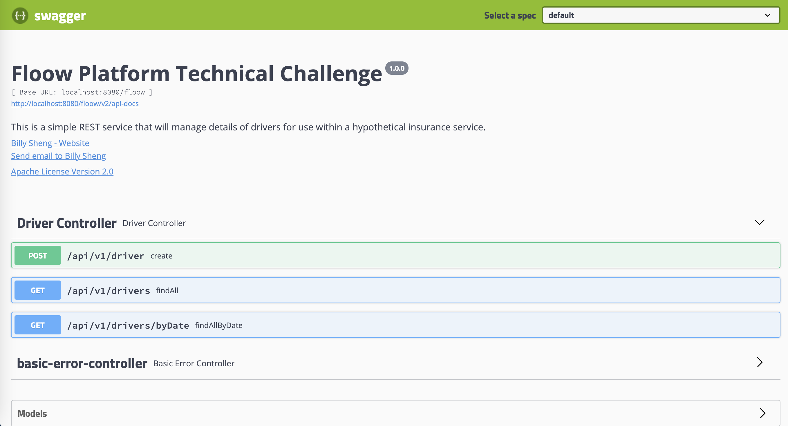
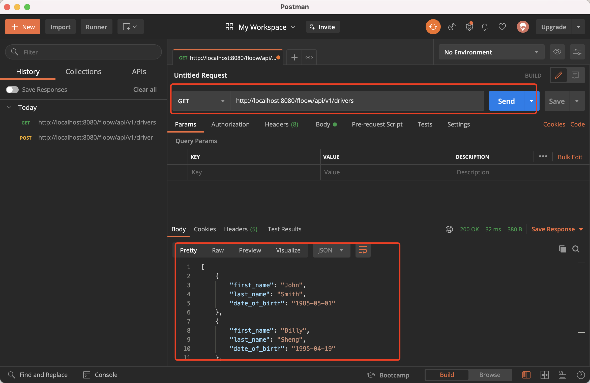

## Floow platform technical challenge project

**=============================== Editor logging ===============================**
|Date|Author|Description|Version|
|----|----|----|----|
|25/06/2021|Daolin Sheng|Create and implement the project|0.0.1-SNAPSHOT|
|26/06/2021|Daolin Sheng|Update some function|0.0.1-SNAPSHOT|

### Table of Contents
* [Project Objective](#objective)
* [Develop environment and Technology Stack](#stack)
* [The structure of project](#structure)
* [How to install and run this Project?](#install)
* [The REST APIs](#function)
* [Testing with Swagger2](#swagger)
* [Testing with Postman](#postman)

### Project Objective 
> The objective of this challenge is to create a simple REST service that will manage details of drivers for use
within a hypothetical insurance service. For the purposes of this challenge, a driver record consists of the
following information:
- A unique ID for the driver
- Fisrt Name
- Last Name
- Date of Birth
- Creation Date

Details of drivers should be stored in a simple flat file. You may store dates in any format you wish.

### Develop environment and Technology Stack 
#### Development evironment
- Mac OS
- IntelliJ IDEA
- JDK 1.8

#### Technology Stack
- Java 8
- Maven 3.6.3
- Swagger2
- Postman
- Springboot 2.5.2
- Spring Validation
- JPA
- Slf4j
- JSON (fastJson, Jackson)
- Junit
- Springboot test
- Mockito

### The structure of project 
/src/main/java/com/floow/challenge/web
  - /config
     - SwaggerConfig.java # config swagger2 
  - /controller
     - DriverController.java # Controller
  - /domain
     - Driver.java     # Driver Entity
  - /exception
     - BusinessException.java  
     - ExceptionEnum.java
     - GlobalExceptionHandler.java
  - /repository
     - DatabaseLoader.java  # load data sources from Json file
     - DriverDao.java       #
  - /service
     - IDriverService       # the interface of DriverService
     - /impl
        - DriverServiceImpl
  - /utils
  - FloowProjectApplication.java
  
/src/main/resources
  - application.yml  # Springboot global config file
  - driver.json      # the file for storage the driver data
  
/src/test/java/com/floow/challenge/web
  - /service
     - RegisterDriverCase.java
  - DriverUseCaseTest.java      # Unit test with Junit
  - DriverUseCaseTest2.java     # Unit test with Mockito

### How to install and run this Project? 
If you want to run this project, there are two method can be use. However, firstly, you cloud clone this project to your local workspace.    
`
git clone https://github.com/linksdl/floow-platform-technical-project.git
`
#### Method 1: running the jar package on your local server.
- change to the `bin` directory:   `cd /floow-platform-technical-project/bin`
- then run `java -jar floow-project-0.0.1-SNAPSHOT.jar`
- **The run result on the server shown in the picture.**

#### Method 2: running the project on your IDEA.

### The REST APIs 
> The APIs for Driver operations in a SpringBoot, and the root path: `http://<ip>:<port>/floow/api/v1`.
> If you run on local, the root path is: `http://localhost:8080/floow/api/vi` 

|Operation|Path| Description|
|----|----|----|
|POST|/drive  | An POST endpoint to allow new drivers to be created and stored. |
|GET |/drives | A GET endpoint which returns a list of all existing drivers in JSON format.|
|GET |/drivers/byDate?date=<date>|A GET endpoint which returns a list of all drivers created after the specified date. Again, the list should be returned in JSON format. Again, the date parameter should use the format YYYY-MM-DD.|

### Testing with Swagger2 
- [Overview of the Swagger2](http://<localhost>:8080/floow/swagger-ui.html)(http//<localhost>:8080/floow/swagger-ui.html)

- Create or add one driver
> POST http://localhost:8080/floow/api/v1/driver
 
        
 
- Find all drivers
> GET http://localhost:8080/floow/api/v1/drivers

- Find all drivers by Date (creation date)
> http://localhost:8080/floow/api/v1/drivers/byDate?date=<Date>

### Testing with Postman 
- Create or add one driver
> POST http://localhost:8080/floow/api/v1/driver
       
 
- Find all drivers
> GET http://localhost:8080/floow/api/v1/drivers

- Find all drivers by Date (creation date)
> http://localhost:8080/floow/api/v1/drivers/byDate?date=<Date>

